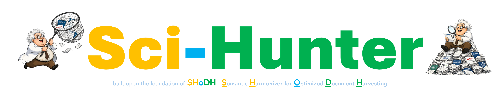

  

# Sci-Hunter 🧬🔍

**Automated Literature Mining and Semantic Harmonization**

**Sci-Hunter** is an open-access, automated and highly customizable literature mining tool designed to query the PubMed database, extract relevant manuscripts using multiple keyword, and perform advanced text matching to identify specific user-defined features. 

The application is built upon the foundation of **SHoDH (Semantic Harmonizer for Optimized Document Harvesting)**, a computational framework originally developed by **Dr. Deeptarup Biswas** in 2022. It is engineered to streamline high-throughput systematic reviews and integrate seamlessly into advanced biomedical analysis workflows.

The Sci-Hunter is currently deployed in Hugging Face - link: **[https://deepbiswas-sci-hunter.hf.space/](https://deepbiswas-sci-hunter.hf.space/)**

For inquiries, feedback, or collaboration opportunities, please feel free to reach out [deeptarupbiswas2020@gmail.com](mailto:deeptarupbiswas2020@gmail.com) | [LinkedIn](https://www.linkedin.com/in/deeptarup-biswas-039825178/)

---

## 📊 Understanding the Metrics & Search Logic

To maximize the accuracy of your literature mining, it is crucial to understand the underlying SHoDH framework metrics:

### 1. The Similarity Index (Match Ratio)
The tool uses a flexible Match Ratio (**0% to 100%**) to map keywords against manuscript texts.
* **100% Match:** Demands an exact, character-for-character match (recommended for exact identifiers).
* **< 100% Match:** Allows for slight string variations. Lowering the threshold (e.g., to 95-98%) is best used to catch hyphenations (e.g., *wild-type* vs *wildtype*) or minor suffixes. **Warning:** Lowering the threshold below 95% significantly increases the risk of false positives.

### 2. Confidence Score Calculation
When running a custom `.csv` feature mapping, Sci-Hunter calculates a unique **Confidence Score** to gauge the relevance of a specific manuscript to your target feature.
* **Formula:** `((Title Frequency * 1.5) + Abstract Frequency) * (Avg Similarity / 100)`
* **Rationale:** Mentions of a target feature in a manuscript's title are weighted 1.5x heavier than mentions in the abstract, as title inclusion is a strong indicator of the paper's central clinical or biological focus.

---

## ⚠️ Disclaimers & Notes for Users

Please read the following carefully before using the tool for academic or clinical research:

1.  **API Fetch Limits:** While you can download as many manuscript lists as needed, significantly larger fetch requests will linearly increase computational processing time. Please ensure a stable internet connection and be patient during large background pulls.
2.  **NCBI / PubMed Uptime:** Sci-Hunter relies directly on the NCBI API infrastructure. If the tool fails to fetch records, verify that the PubMed database is currently online and not undergoing maintenance.
3.  **Manuscript Type Tagging:** The "Manuscript Type Filter" (e.g., *Only Journal Article*) relies strictly on metadata tags provided by PubMed. Sci-Hunter is not responsible for misclassified or untagged literature on the NCBI database. Selecting specific filters may inadvertently exclude Meta-Analyses, Letters, or Database papers.
4.  **No Medical Advice:** This tool is for research and literature harmonization purposes only. The outputs generated by Sci-Hunter do not constitute clinical or medical advice.

---

## 👨‍💻 Developer & Citation

Sci-Hunter is developed and maintained by **Dr. Deeptarup Biswas**. 

If Sci-Hunter or the SHoDH algorithm contributes to your research, publication, presentation, or analytical workflow, please acknowledge the tool and its developer in the appropriate methodology or acknowledgment section of your work.

**Contact:** [deeptarupbiswas2020@gmail.com](mailto:deeptarupbiswas2020@gmail.com) | [LinkedIn](https://www.linkedin.com/in/deeptarup-biswas-039825178/)

---

## 📜 License

Sci-Hunter is protected under the **MIT License**. The software is provided "as is", without warranty of any kind, express or implied. Users are free to use and distribute the software in accordance with the terms of the MIT License, while retaining appropriate copyright and license notices.

**Authentication & Privacy:** A quick login is required to access the tool. The email address provided will be used solely to satisfy NCBI API requirements for server requests and will be associated only with that active session.
